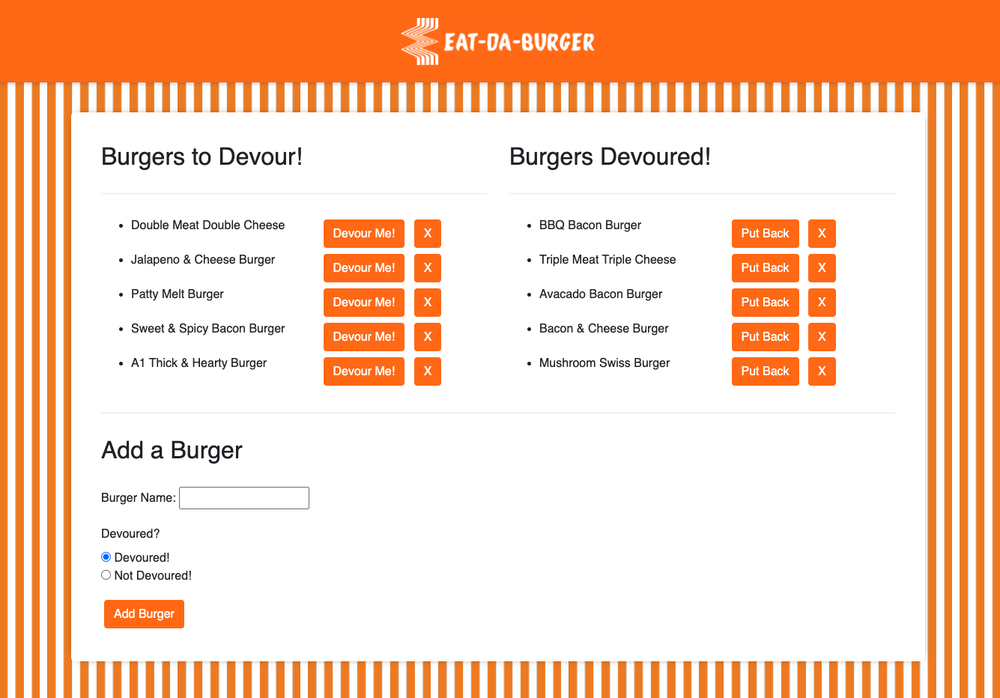

  # TeamGenerator

  ## Description
  A burger logger created with MySQL, Node, Express, Handlebars and a homemade ORM (yum!). This application follows the MVC (Model, View, Controller) design pattern.

  Heroku URL:
  https://tranquil-everglades-64817.herokuapp.com/

  ## Table of Contents

  * [Usage](#usage)
  * [Technologies](#technologies)
  * [Credits](#credits)
  * [Author](#author)

  ## Usage
   ```bash
   `npm install` to install all packages required to run the app. These include `express`, `express-handlebars` and `mysql`
   ```
  ```bash 
  `node server.js` to run the app
  ```
  ```bash
  Navigate to `http://localhost:8080`
  ```

  

  ## Credits
  I would like to give some credit to my tutor John Knowles https://github.com/jaknowles97.

  ## Technologies
  * HTML
  * CSS
  * Bootstrap
  * Express
  * Handlebars
  * MySQL
  * Javascript
  * JQuery
  * ORM
  * AJAX
 

  ## Author

  Dave Powell

  

  * [Github Profile](https://github.com/evadllewop)
  * [Project Repo](https://github.com/evadllewop/TeamGenerator)

